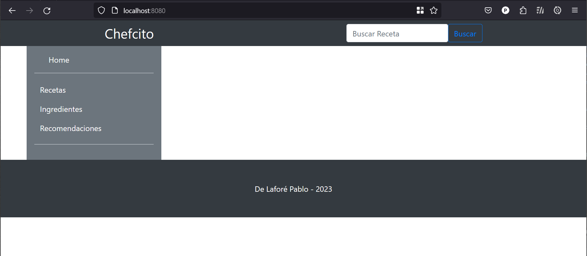

# Chefcito
Chefcito is a cooking app that aims to provide variety of recipes and help to maintain a balance diet

DEMO PREVIEW
I currently don't have a service to host the database to show a fully deployed web app
v0.1

  

Features

✅ secured token login

✅ create recepies

⬛ Search by ingredients

⬛ Search recepies given available ingredients

⬛ Filter out unwanted/alergic ingredients

⬛ Filter by diet types (vegetarian/vegan/keto...)

⬛ Social Interaction between accounts

## Technologies Used
- Spring Boot
- Spring Security 
- Maven
- JWT 
- Thymeleaf
- MySQL

